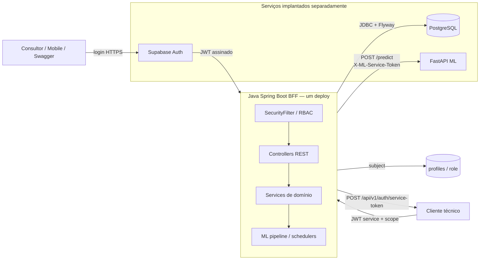

# Arquitetura Sprint 3

Fluxo humano: login no Supabase Auth → JWT → validação de assinatura, issuer/audience e subject pelo BFF → busca de `profiles` → role `ADMIN`, `GESTOR` ou `ANALISTA`.

Fluxo técnico: cliente envia credenciais para `/api/v1/auth/service-token` → BFF valida `private.api_clients` → emite JWT HS256 separado, com issuer `API Ford`, audience `pulso-retencao-api`, tipo `service` e scopes → BFF autoriza o escopo necessário.

O BFF chama a FastAPI somente por `/predict` e `/predict-batch`; a rota pública do BFF para predição é `/api/ml/predict`.
